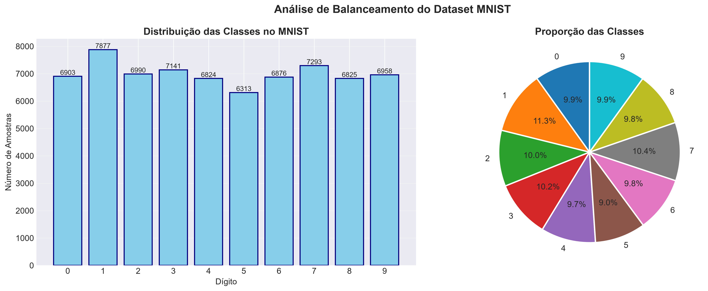
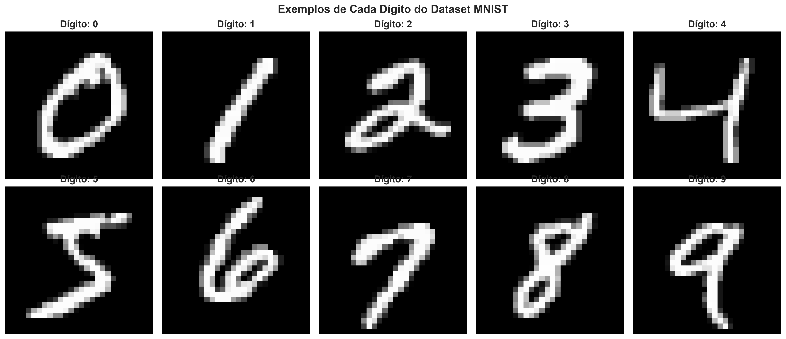
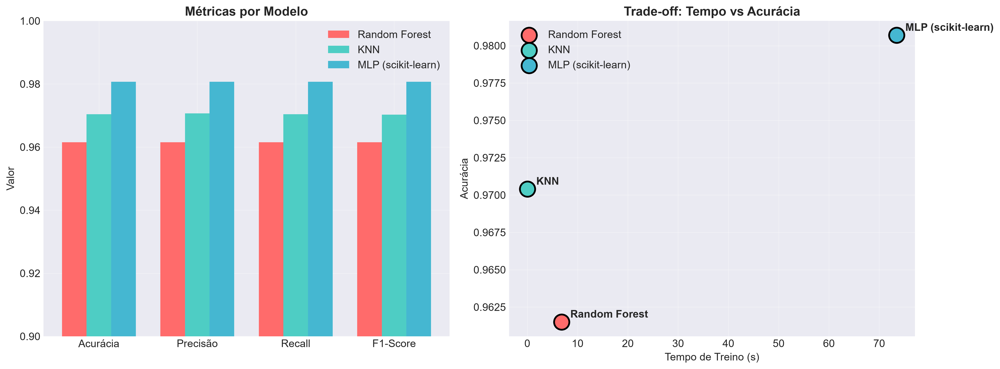
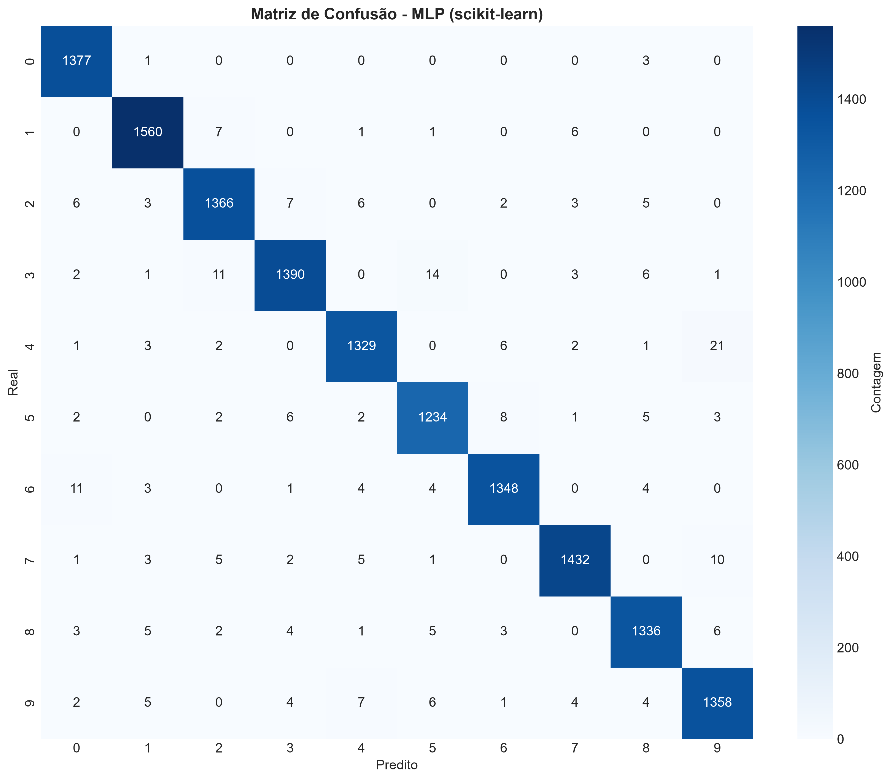
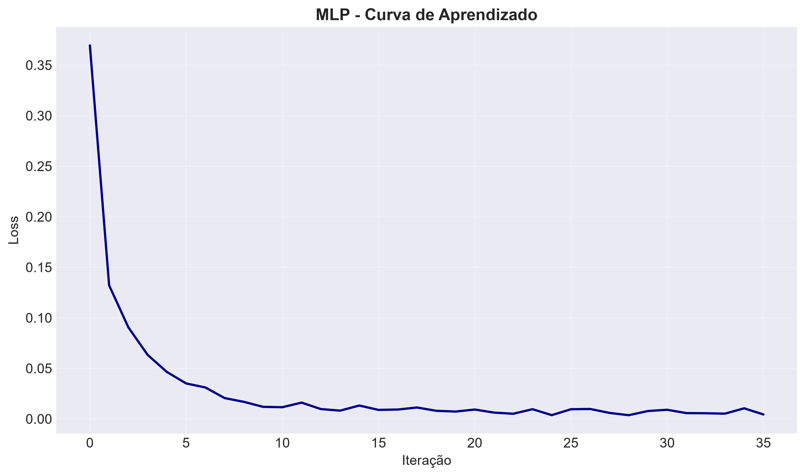
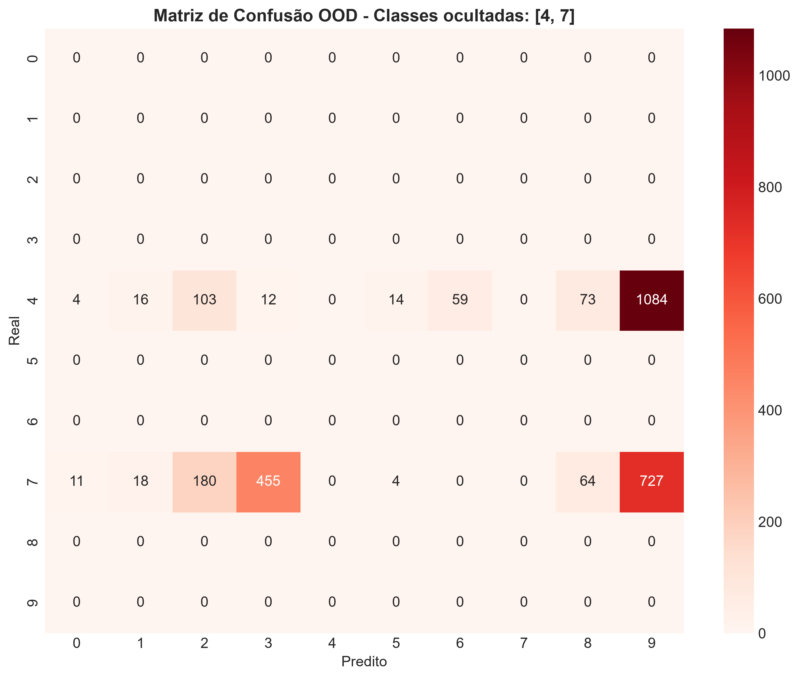
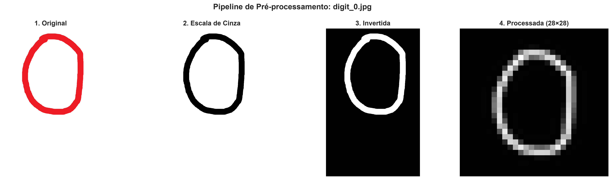

# MNIST Digit Classifier

**Pipeline completo de Machine Learning para classificação de dígitos manuscritos.**

[](https://www.python.org/)
[](https://scikit-learn.org/)
[](LICENSE)
[]()

---

## 📌 Sobre o Projeto

Este projeto implementa um **pipeline de Ciência de Dados ponta a ponta** para classificação de dígitos manuscritos usando o dataset **MNIST**. O objetivo é comparar três algoritmos distintos de Machine Learning e avaliar a robustez dos modelos em cenários adversos.

**Modelos implementados:** Random Forest · KNN · MLP (scikit-learn)

---

## 🎯 Problema Resolvido

Classificação multiclasse de imagens 28×28 pixels em 10 dígitos (0–9), com testes de generalização em dados fora da distribuição de treino.

**Aplicações práticas:** OCR, leitura de cheques, automação bancária, digitalização de documentos.

---

## 🛠️ Tecnologias Utilizadas

| Categoria | Ferramentas |
| ----------- | ------------- |
| **Linguagem** | Python 3.9 – 3.13 |
| **Machine Learning** | scikit-learn |
| **Manipulação de Dados** | NumPy, Pandas |
| **Visualização** | Matplotlib, Seaborn |
| **Imagens** | Pillow (PIL) |
| **Ambiente** | Jupyter Notebook |

---
````
## 📁 Estrutura do Projeto

mnist-digit-classifier/
│
├── mnist_pipeline.ipynb           # Notebook principal
├── requirements.txt               # Dependências
├── README.md                      # Documentação
├── .gitignore                     # Arquivos ignorados pelo Git
├── LICENSE                        # Licença MIT
│
├── data/
│   ├── mnist.npz                  # Dataset em cache (gerado automaticamente)
│   └── own_images/                # Imagens manuscritas próprias
│       ├── digit_0.jpg
│       ├── digit_1.jpg
│       ├── ...
│       └── digit_9.jpg
│
├── results/                       # Gráficos e resultados gerados
│
└── docs/
    └── images/                    # Imagens usadas no README
```
---

## ⚙️ Instalação

### Pré-requisitos

- Python 3.9 a 3.13 (recomendado: **3.11** ou **3.12**)
- Pip instalado

### Passos

# 1. Clonar o repositório

git clone <https://github.com/seu-usuario/mnist-digit-classifier.git>
cd mnist-digit-classifier

# 2. Instalar dependências

pip install -r requirements.txt

# 3. Verificar instalação

python check_requirements.py

---

## ▶️ Como Executar

jupyter notebook mnist_pipeline.ipynb

Execute as células **em ordem** — a estrutura de pastas e o cache do dataset são criados automaticamente.

---

## 📊 Análise Exploratória

O dataset MNIST é **balanceado**, com aproximadamente 7.000 imagens por dígito (0-9).





---

## 🔬 Pipeline do Projeto

| Etapa | Descrição |
| ------- | ----------- |
| **1. EDA** | Carregamento do MNIST + análise exploratória |
| **2. Pré-processamento** | Divisão 70/10/20 + normalização [0,1] |
| **3. Modelagem** | Random Forest, KNN e MLP |
| **4. Avaliação** | Matrizes de confusão + métricas comparativas |
| **5. Robustez** | Class Masking, Inferência OOD e imagens próprias |

---

## 📈 Resultados

### Comparação dos Modelos

| Modelo | Acurácia | Tempo de Treino |
| -------- | ---------- | ----------------- |
| Random Forest | ~96,9% | ~35 s |
| KNN | ~97,0% | < 1 s |
| **MLP (scikit-learn)** | **~98,0%** | ~120 s |

> 💡 Valores típicos. Podem variar ligeiramente entre execuções.



### Matrizes de Confusão



**Principais confusões:** 4 ↔ 9 · 7 ↔ 1 · 3 ↔ 5

### Curva de Aprendizado do MLP



---

## 🛡️ Análise de Robustez

### Teste OOD (Out-of-Distribution)

Modelo treinado **sem os dígitos 4 e 7**, testado nessas classes ocultadas:



**Conclusões:**

- O modelo atribui classes conhecidas mesmo sem nunca ter visto 4 e 7
- **Overconfidence**: alta confiança em predições erradas
- É necessário implementar **detecção de OOD** em sistemas críticos

### Inferência com Imagens Próprias

Pipeline de pré-processamento aplicado em dígitos manuscritos digitalizados:




---

## 📈 Melhorias Futuras

- Implementação de CNNs (Redes Neurais Convolucionais)
- Detecção automática de OOD com calibração de probabilidades
- Otimização de hiperparâmetros (GridSearch / Optuna)
- API REST para inferência em produção

---

## 📄 Licença

Distribuído sob a licença **MIT**. Consulte o arquivo [LICENSE](LICENSE) para mais informações.

---

## 📚 Referências

- [MNIST Dataset — Yann LeCun](http://yann.lecun.com/exdb/mnist/)
- [Scikit-learn Documentation](https://scikit-learn.org/)
- [NumPy Documentation](https://numpy.org/)
- [Pandas Documentation](https://pandas.pydata.org/)

---
